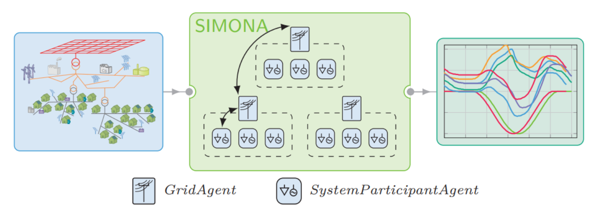

(about)=
# About Simona

SIMONA is a simulation tool for generating time-series in the context of distribution grids to be used in grid planning, 
operation and analysis. The simulation is executed using an agent-based, discrete-event model. SIMONA is being developed
at the [Institute of Energy Systems, Energy Efficiency and Energy Economics](https://ie3.etit.tu-dortmund.de) at
[TU Dortmund University](https://www.tu-dortmund.de), Germany.

## Power Grid Model
With Simona, you can model your power grid using a broad variety of different available asset types. The input data for
the grid must be provided as PSDM-data. (For more information on this data type, go to the
{doc}`PowerSystemDataModel <psdm:index>` documentation.) The combination of implemented
physical participant models and your provided input data forms a power grid that can be further investigated and 
analysed using Simona services.

## Simulation
Simona is designed to simulate the assets' behaviour with each other and with the grid itself. In this process, Simona
uses an individuality approach, meaning that the simulation is focussed on the individual behaviour of the assets rather
than the entire grid. 

Since Simona uses an agent-based approach, the assets are modelled as agents. There are system participant agents (SPA),
which represent generators or loads commonly used in distribution grids (PV, Wind Turbine, EV, Storages, ...). In 
addition to that, a grid agent (GA) manages the interaction with other grid agents and with the subordinate SPAs.

## Further Information and Contact Details

Please, visit the SIMONA [website](https://simona.ie3.e-technik.tu-dortmund.de) for further Information. You will find 
the current developers' contact information.
