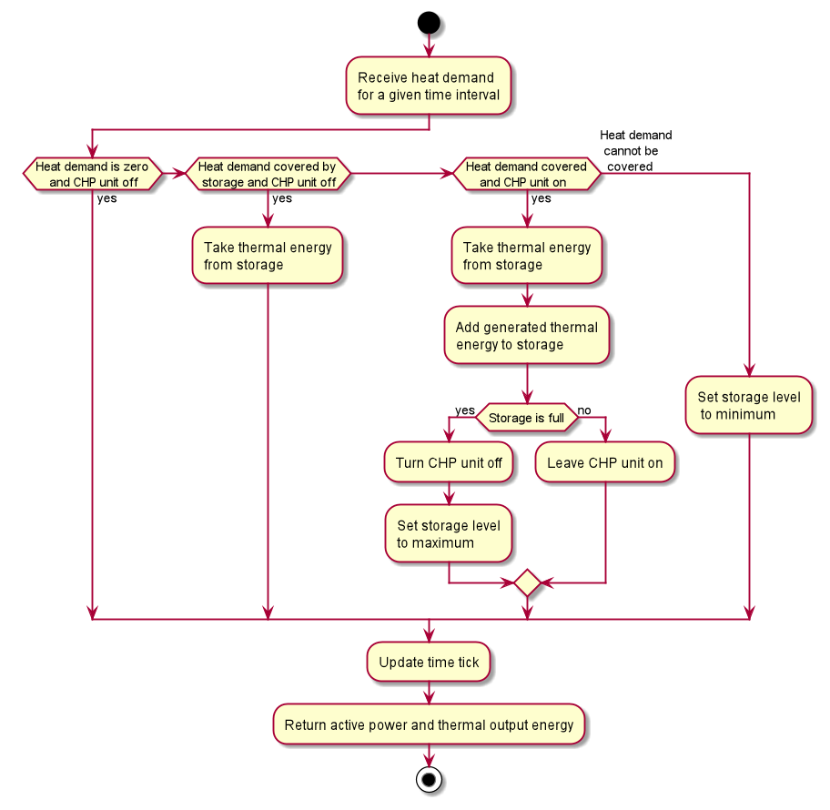

(chp_model)=

## ChpModel

This page documents the functionality of the CHP Model (combined heat and power plant model) available in SIMONA. This model is part of the SIMONA simulation framework and represented by an agent. The current model is feasible to simulate nano- and micro-CHP units. As it is a cross-sector agent heat/electricity) the usage of a house-heat-model is mandatory.

### Attributes, Units and Remarks

| Attribute         | Unit | Remarks                                         |
| ------------------- | ------ | ------------------------------------------------- |
| uuid              | --   | universally unique identifier                   |
| id                | --   | human readable identifier                       |
| operationInterval | --   | time interval, in which the system is operating |
| scalingFactor     | --   | scaling the output of the system                |
| qControl          | --   | type of reactive power control                  |
| sRated            | kVA  | rated apparent power                            |
| cosPhiRated       | --   | rated power factor                              |
| pThermal          | kW   | rated thermal power (generated by CHP unit)     |
| storage           | --   | thermal storage                                 |

### Implemented Behaviour

- Assumptions
  The CHP unit is able to operate either at full load or not at all. Uncovered heat demand of former time steps is not considered in the following steps, as the CHP unit does not posses a memory.
- Agent Objectives
  The objective of the CHP agent is to cover the given heat demand in each time-step.
- Storage medium
  This model can be implemented with any mutable storage (meaning that the storage requires the     trait MutableStorage). The CHP unit is able to store/take energy, while the underlying storage medium performs the calculations for these operation.

The implemented behaviour is shown in the program sequence plan below. In general, the unit will turn on, if the energy in the storage is too low to satisfy the given heat demand and will turn off if the storage is completely filled. During operation, the CHP unit operates at full utilization.

### Implementation:

### Mathematical concept

The implementation of the CHP unit's behavior is based on the following mathematical model.

| Variable     | Remarks                                                      |
| ------------ |--------------------------------------------------------------|
| c(t)         | indicates if the CHP unit is running or not                  |
| I            | interval of two time steps (t-1, t]                          |
| td(t)        | time of a single time step                                   |
| WD(t)        | heat demand                                                  |
| Wchp,n(t)    | rated heat production                                        |
| Wst(t)       | storage level of the storage medium given by energy          |
| Wst,min      | minimum storage level of the storage medium given by energy  |
| Wst,max      | maximum storage level of the storage medium given by energy  |
| Wges(t)      | Wchp,n(t) + Wst(t)                                           |
| deltaWD(t)   | WD(t) - Wchp,n(t)                                            |
| Qth,chp,n(t) | rated heat flow produced by the CHP                          |
| Pchp,n(t)    | rated active power production                                |
| Pgen(t)      | generated active power                                       |
| Qgen(t)      | generated reactive power                                     |

Given a time interval I, the heat demand WD(t-1), the running status c(t-1) and the storage energy level Wst(t-1) the CHP model calculates if the heat demand can be covered and if the CHP unit has to be turned off/on.
