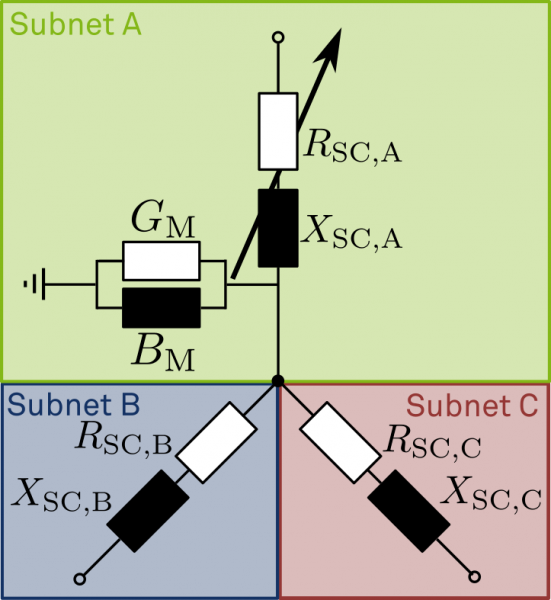

(three_winding_transformer_model)=
## Three winding transformer

### Attributes, Units and Remarks

Input and Result Attributes and Units are defined at PowerSystemDataModel. Please refer to:

- Input: {doc}`PowerSystemDataModel - Three Winding Transformer Model <psdm:models/input/grid/transformer3w>`
- Result: {doc}`PowerSystemDataModel - Three Winding Transformer Model <psdm:models/result/grid/transformer3w>`

### General Information

A three-winding transformer is a transformer, that is able to connect three galvanically separated subgrids, that are on three different voltage levels.
It is commonly used to connect high voltage to extra high voltage grids.

#### Model to subgrid assignment
Having an asset, that connects three different voltage levels, is a special situation to SIMONA.
Please remember, that we assign a two-winding transformer model to the inferior subgrid, as its tap changer control is determined by the needs of the underlying grid.
However, for three-winding transformers this decision does not make sense.
We decompose the three-winding transformer's physical model into three sub-models and join their partial results within the protocol of the distributed power flow calculation.

The following basic principles lead us to the implemented solution:
- A distinct subgrid agent shall only handle one voltage level. The only exception are the replicated nodes from superior subgrids.
- Transformer tap control actions are issued based on decisions taken in the underlying grid
- The power flow across the highest voltage branch shall be as precise as possible

This is why we divide the physical three-winding transformer model (which is a T-equivalent circuit with an additional branch) as shown in the figure below.



Being scissored at the artificial central node, allows for the model in subgrid A to remain in one single voltage level.
The transformation between voltage level A and B or C, respectively, happens during the message exchange between the `GridAgent`s for subgrid A and B as well as C.
Moreover, the power flow across branch B and C are properly accumulated and thus accounted for in branch A.
More details on the physical model transformation can be found in the Ph.D. thesis linked at the bottom of the page.

#### Initialization and setup logic
- During setup of the `GridAgent`s, the central node of the model is generated automatically
- Also, the model is scissored automatically
- Coupling of subgrids is provided by means of inter-agent communication
- The tap changer is always apparent in subgrid A. If subgrid B or C require an adaption, they send a tap request with provided power values, subgrid A takes a decision and re-evaluates the outcome

**References:**

```{eval-rst}
:cite:cts:`Kittl_2021`
```
